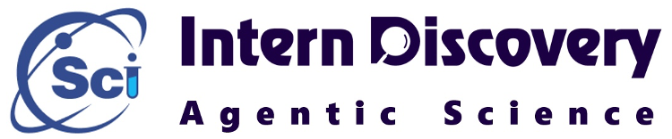
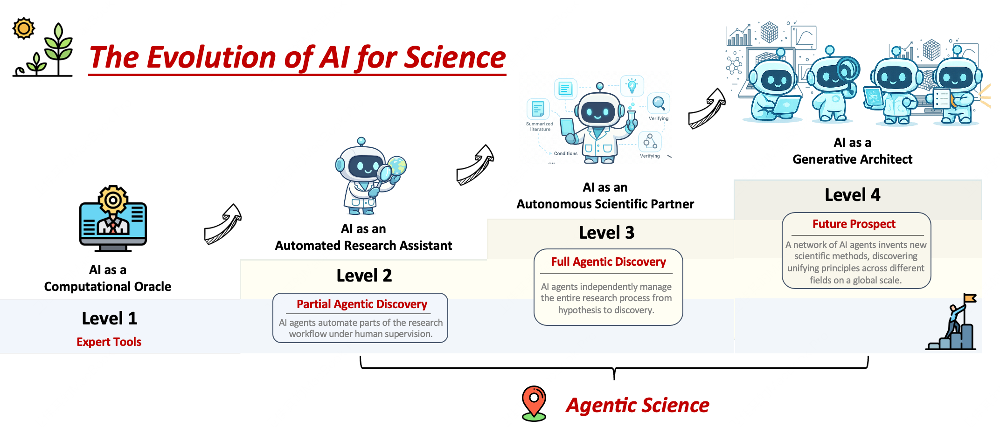
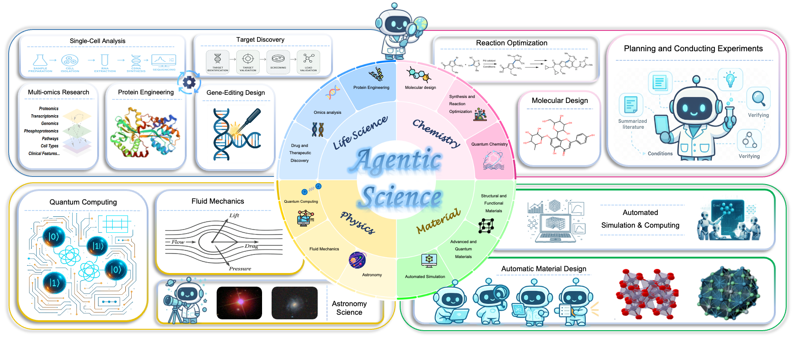

<div align="center">
  <h1>From AI for Science to Agentic Science: 
    A Survey on Autonomous Scientific Discovery 🤖</h1>
  
  <br><br> 
    

  <br><br> 

  [](https://agenticscience.github.io/)
  [](https://arxiv.org/abs/2508.14111)
  [](https://example.com/citations)
  [](LICENSE)  

  <br> 
  
Welcome to the **"Agentic Science"** repository ！

This repository, part of the **Intern Discovery** project, 

showcases **how AI/Agent is becoming a creative scientist, accelerating and reshaping scientific discovery**.

Explore this detailed repository to understand how autonomous agents are revolutionizing natural science!


🔔 🔔 🔔 For more detailed information, please refer to [our paper](https://agenticscience.github.io/) or [homepage](https://agenticscience.github.io/)~

✉️ ➡️ 📪 If you have any questions, please feel free to contact us at:

**{weijiaqi, yangyuejin}@pjlab.org.cn | `zzhang23@ualberta.ca`**


</div>

## 👋 Introduction 

**Scientific discovery** is experiencing a transformative shift, driven by the rapid evolution of artificial intelligence
(AI) from specialized tools to collaborative research partners. This progression marks a pivotal stage in the
**AI for Science paradigm**, where AI systems have moved from acting as computational oracles for targeted
tasks toward the emergence of **Agentic Science**. In this stage, AI operates as an autonomous scientific agent capable of formulating hypotheses, designing and
executing experiments, interpreting results, and iteratively refining theories with reduced dependence on human guidance.


*Figure 1: Caption describing the main areas.*

***

Despite significant progress, a unified framework for understanding and designing increasingly autonomous scientific systems is still lacking. While existing work has laid valuable foundations, it remains **fragmented—focusing separately** on workflows, autonomy scales, or architectures, and often lacking a clear emphasis on the natural sciences. To bridge these gaps, our work integrates and extends these perspectives through **a comprehensive framework**. Additionally, we present **the first domain-oriented review** of autonomous scientific discovery, offering a detailed synthesis of research advancements and key discoveries within each discipline.


*Figure 2: Caption describing the main areas.*

---

Finally, **Our Key Contributions** are as follows:

1. **The Anatomy of Scientific Agents: Five Core Capabilities**:
   - **Reasoning and Planning**
   - **Tool Use and Integration**
   - **Memory Mechanisms**
   - **Multi-Agent Collaboration**
   - **Optimization and Evolution**

2. **The Dynamic Workflow of Agentic Science: Four Core Stages**
   - **Observation and Hypothesis Generation**
   - **Experimental Planning and Execution**
   - **Data Interpretation and Analysis**:
   - **Synthesis and Iterative Refinement**s.

3. **Systematic Review Across Natural Sciences**
 We conduct a comprehensive review of agentic systems across the major domains of natural science:
      - **Life Sciences**, **Chemistry**, **Materials Science**, and **Physics**.  


## 📢 Contents

- [Part 0: Fully Autonomous Research Pipeline](#part-0-fully-autonomous-research-pipeline)

- [Part 1: Agentic Life Science Research](#part-1-agentic-life-science-research)
  - [General Frameworks and Methodologies](#general-frameworks-and-methodologies)
  - [Genomics, Transcriptomics and Multi-Omics Analysis](#genomics-transcriptomics-and-multi-omics-analysis)
  - [Protein Science and Engineering](#protein-science-and-engineering)
  - [Drug and Therapeutic Discovery](#drug-and-therapeutic-discovery)

- [Part 2: Agentic Chemistry Research](#part-2-agentic-chemistry-research)
  - [General Frameworks and Methodologies](#general-frameworks-and-methodologies-1)
  - [Organic Synthesis and Reaction Optimization](#organic-synthesis-and-reaction-optimization)
  - [Generative Chemistry and Molecular Design](#generative-chemistry-and-molecular-design)
  - [Computational and Quantum Chemistry](#computational-and-quantum-chemistry)

- [Part 3: Agentic Materials Science Research](#part-3-agentic-materials-science-research)
  - [General Frameworks and Automated Workflows](#general-frameworks-and-automated-workflows)
  - [Structural and Functional Materials](#structural-and-functional-materials)
  - [Advanced and Quantum Materials](#advanced-and-quantum-materials)

- [Part 4: Agentic Physics and Astronomy Research](#part-4-agentic-physics-and-astronomy-research)
  - [General Frameworks and Methodologies](#general-frameworks-and-methodologies-2)
  - [Astronomy and Cosmology](#astronomy-and-cosmology)
  - [Computational Mechanics and Fluid Dynamics](#computational-mechanics-and-fluid-dynamics)
  - [Quantum Computing](#quantum-computing)
  
  ---


## Part 0: Fully Autonomous Research Pipeline

<ul>
  <li>
    <i><b>SciMaster: Towards General-Purpose Scientific AI Agents, Part I. X-Master as Foundation: Can We Lead on Humanity's Last Exam?</b></i>, Jingyi Chai et al. 
    <a href="https://arxiv.org/pdf/2507.05241?" target="_blank">
      
    </a>
  </li>
  <li>
    <i><b>NovelSeek: When Agent Becomes the Scientist--Building Closed-Loop System from Hypothesis to Verification</b></i>, Bo Zhang et al. 
    <a href="https://arxiv.org/pdf/2505.16938" target="_blank">
      
    </a>
  </li>
  <li>
    <i><b>Large language models for automated open-domain scientific hypotheses discovery</b></i>, Zonglin Yang et al. 
    <a href="https://arxiv.org/pdf/2309.02726" target="_blank">
      
    </a>
  </li>
  <li>
    <i><b>Maps: A multi-agent framework based on big seven personality and socratic guidance for multimodal scientific problem solving</b></i>, Jian Zhang et al. 
    <a href="https://arxiv.org/pdf/2503.16905?" target="_blank">
      
    </a>
  </li>
  <li>
    <i><b>Agentrxiv: Towards collaborative autonomous research</b></i>, Samuel Schmidgall et al. 
    <a href="https://arxiv.org/pdf/2503.18102?" target="_blank">
      
    </a>
  </li>
  <li>
    <i><b>Dolphin: Closed-loop open-ended auto-research through thinking, practice, and feedback</b></i>, Jiakang Yuan et al. 
    <a href="https://ui.adsabs.harvard.edu/abs/2025arXiv250103916Y/abstract" target="_blank">
      
    </a>
  </li>
  <li>
    <i><b>Towards an AI co-scientist</b></i>, Juraj Gottweis et al. 
    <a href="https://arxiv.org/pdf/2502.18864" target="_blank">
      
    </a>
  </li>
  <li>
    <i><b>The AI scientist: Towards fully automated open-ended scientific discovery</b></i>, Chris Lu et al. 
    <a href="https://arxiv.org/pdf/2408.06292?" target="_blank">
      
    </a>
  </li>
  <li>
    <i><b>The virtual lab: AI agents design new SARS-CoV-2 nanobodies with experimental validation</b></i>, Kyle Swanson et al. 
    <a href="https://www.biorxiv.org/content/biorxiv/early/2024/11/12/2024.11.11.623004.full.pdf" target="_blank">
      
    </a>
  </li>
  <li>
    <i><b>SpatialAgent: An autonomous AI agent for spatial biology</b></i>, Hanchen Wang et al. 
    <a href="https://www.biorxiv.org/content/10.1101/2025.04.03.646459.full" target="_blank">
      
    </a>
  </li>
  <li>
    <i><b>Biomni: A general-purpose biomedical AI agent</b></i>, Kexin Huang et al. 
    <a href="https://www.biorxiv.org/content/10.1101/2025.05.30.656746.full.pdf" target="_blank">
      
    </a>
  </li>
  <li>
    <i><b>Automating exploratory proteomics research via language models</b></i>, Ning Ding et al. 
    <a href="https://arxiv.org/pdf/2411.03743" target="_blank">
      
    </a>
  </li>
  <li>
    <i><b>Matpilot: An LLM-enabled AI materials scientist under the framework of human-machine collaboration</b></i>, Ziqi Ni et al. 
    <a href="https://arxiv.org/pdf/2411.08063" target="_blank">
      
    </a>
  </li>
  <li>
    <i><b>Tora: A tool-integrated reasoning agent for mathematical problem solving</b></i>, Zhibin Gou et al. 
    <a href="https://arxiv.org/pdf/2309.17452" target="_blank">
      
    </a>
  </li>
  <li>
    <i><b>STELLA: Self-Evolving LLM Agent for Biomedical Research</b></i>, Ruofan Jin et al. 
    <a href="https://arxiv.org/pdf/2507.02004" target="_blank">
      
    </a>
  </li>
  <li>
    <i><b>Two heads are better than one: A multi-agent system has the potential to improve scientific idea generation</b></i>, Haoyang Su et al. 
    <a href="https://openreview.net/pdf?id=yYQLvofQ1k" target="_blank">
      
    </a>
  </li>
  <li>
    <i><b>Dora AI scientist: Multi-agent virtual research team for scientific exploration discovery and automated report generation</b></i>, Vladimir Naumov et al. 
    <a href="https://www.biorxiv.org/content/biorxiv/early/2025/03/07/2025.03.06.641840.full.pdf" target="_blank">
      
    </a>
  </li>
  <li>
    <i><b>DiscoveryWorld: A virtual environment for developing and evaluating automated scientific discovery agents</b></i>, Peter Jansen et al. 
    <a href="https://proceedings.neurips.cc/paper_files/paper/2024/file/13836f251823945316ae067350a5c366-Paper-Datasets_and_Benchmarks_Track.pdf" target="_blank">
      
    </a>
  </li>
  <li>
    <i><b>Autonomous chemical research with large language models</b></i>, Daniil A. Boiko et al. 
    <a href="https://www.nature.com/articles/s41586-023-06792-0.pdf" target="_blank">
      
    </a>
  </li>
  <li>
    <i><b>ResearchAgent: Iterative research idea generation over scientific literature with large language models</b></i>, Jinheon Baek et al. 
    <a href="https://arxiv.org/pdf/2404.07738?" target="_blank">
      
    </a>
  </li>
  <li>
    <i><b>Agent laboratory: Using LLM agents as research assistants</b></i>, Samuel Schmidgall et al. 
    <a href="https://arxiv.org/pdf/2501.04227" target="_blank">
      
    </a>
  </li>
  <li>
    <i><b>Agent hospital: A simulacrum of hospital with evolvable medical agents</b></i>, Junkai Li et al. 
    <a href="https://arxiv.org/pdf/2405.02957" target="_blank">
      
    </a>
  </li>
  <li>
    <i><b>Conversational health agents: A personalized LLM-powered agent framework</b></i>, Mahyar Abbasian et al. 
    <a href="https://arxiv.org/pdf/2310.02374" target="_blank">
      
    </a>
  </li>
  <li>
    <i><b>An automatic end-to-end chemical synthesis development platform powered by large language models</b></i>, Yixiang Ruan et al. 
    <a href="https://www.nature.com/articles/s41467-024-54457-x.pdf" target="_blank">
      
    </a>
  </li>
  <li>
    <i><b>AlphaEvolve: A coding agent for scientific and algorithmic discovery</b></i>, Alexander Novikov et al. 
    <a href="https://arxiv.org/pdf/2506.13131?" target="_blank">
      
    </a>
  </li>
  <li>
    <i><b>Accelerated end-to-end chemical synthesis development with large language models</b></i>, Yixiang Ruan et al. 
    <a href="https://chemrxiv.org/engage/api-gateway/chemrxiv/assets/orp/resource/item/6634f02021291e5d1d58702c/original/accelerated-end-to-end-chemical-synthesis-development-with-large-language-models.pdf" target="_blank">
      
    </a>
  </li>
</ul>

## Part 1: Agentic Life Science Research

### General Frameworks and Methodologies

<ul>
  <li>
    <i><b>Biomni: A General-Purpose Biomedical AI Agent</b></i>, Kexin Huang et al. 
    <a href="https://www.biorxiv.org/content/10.1101/2025.05.30.656746.full.pdf" target="_blank">
      
    </a>
  </li>
  <li>
    <i><b>STELLA: Self-Evolving LLM Agent for Biomedical Research</b></i>, Ruofan Jin et al. 
    <a href="https://arxiv.org/pdf/2507.02004" target="_blank">
      
    </a>
  </li>
  <li>
    <i><b>From Intention to Implementation: Automating Biomedical Research via LLMs</b></i>, Yi Luo et al. 
    <a href="https://arxiv.org/pdf/2412.09429" target="_blank">
      
    </a>
  </li>
  <li>
    <i><b>PiFlow: Principle-aware Scientific Discovery with Multi-Agent Collaboration</b></i>, Yingming Pu et al. 
    <a href="https://arxiv.org/pdf/2505.15047" target="_blank">
      
    </a>
  </li>
  <li>
    <i><b>Empowering Biomedical Discovery with AI Agents</b></i>, Shanghua Gao et al. 
    <a href="https://www.cell.com/cell/fulltext/S0092-8674(24)01070-5?&target=_blank" target="_blank">
      
    </a>
  </li>
</ul>

### Genomics, Transcriptomics and Multi-Omics Analysis

<ul>
  <li>
    <i><b>GeneAgent: Self-verification Language Agent for Gene Set Knowledge Discovery using Domain Databases</b></i>, Zhizheng Wang et al. 
    <a href="https://arxiv.org/abs/2405.16205" target="_blank">
      
    </a>
  </li>
  <li>
    <i><b>BioInformatics Agent (BIA): Unleashing the Power of Large Language Models to Reshape Bioinformatics Workflow</b></i>, Qi Xin et al. 
    <a href="https://www.biorxiv.org/content/biorxiv/early/2024/06/07/2024.05.22.595240.full.pdf" target="_blank">
      
    </a>
  </li>
  <li>
    <i><b>CellAgent: An LLM-driven Multi-Agent Framework for Automated Single-cell Data Analysis</b></i>, Yihang Xiao et al. 
    <a href="https://arxiv.org/pdf/2407.09811" target="_blank">
      
    </a>
  </li>
  <li>
    <i><b>Toward a Team of AI-Made Scientists for Scientific Discovery from Gene Expression Data</b></i>, Haoyang Liu et al. 
    <a href="https://arxiv.org/pdf/2402.12391" target="_blank">
      
    </a>
  </li>
  <li>
    <i><b>CRISPR-GPT: An LLM Agent for Automated Design of Gene-Editing Experiments</b></i>, Kaixuan Huang et al. 
    <a href="https://arxiv.org/pdf/2404.18021" target="_blank">
      
    </a>
  </li>
  <li>
    <i><b>SpatialAgent: An Autonomous AI Agent for Spatial Biology</b></i>, Hanchen Wang et al. 
    <a href="https://www.biorxiv.org/content/10.1101/2025.04.03.646459.full" target="_blank">
      
    </a>
  </li>
  <li>
    <i><b>PhenoGraph: A Multi-Agent Framework for Phenotype-Driven Discovery in Spatial Transcriptomics Data Augmented with Knowledge Graphs</b></i>, Seyednami Niyakan et al. 
    <a href="https://www.biorxiv.org/content/10.1101/2025.06.06.658341.full.pdf" target="_blank">
      
    </a>
  </li>
  <li>
    <i><b>BioAgents: Democratizing Bioinformatics Analysis with Multi-Agent Systems</b></i>, Nikita Mehandru et al. 
    <a href="https://arxiv.org/pdf/2501.06314" target="_blank">
      
    </a>
  </li>
  <li>
    <i><b>BioMaster: Multi-Agent System for Automated Bioinformatics Analysis Workflow</b></i>, Houcheng Su et al. 
    <a href="https://www.biorxiv.org/content/10.1101/2025.01.23.634608.full.pdf" target="_blank">
      
    </a>
  </li>
  <li>
    <i><b>TransAgent: Dynamizing Transcriptional Regulation Analysis via Multi-Omics-Aware AI Agent</b></i>, Guorui Zhang et al. 
    <a href="https://www.biorxiv.org/content/biorxiv/early/2025/04/30/2025.04.27.650826.full.pdf" target="_blank">
      
    </a>
  </li>
  <li>
    <i><b>CompBioAgent: An LLM-Powered Agent for Single-Cell RNA-Seq Data Exploration</b></i>, Haotian Zhang et al. 
    <a href="https://www.biorxiv.org/content/10.1101/2025.03.17.643771.full.pdf" target="_blank">
      
    </a>
  </li>
  <li>
    <i><b>PerTurboAgent: A Self-Planning Agent for Boosting Sequential Perturb-seq Experiments</b></i>, Minsheng Hao et al. 
    <a href="https://www.biorxiv.org/content/10.1101/2025.05.25.656020.full.pdf" target="_blank">
      
    </a>
  </li>
  <li>
    <i><b>PROTEUS: Automating Exploratory Multiomics Research via Language Models</b></i>, Ning Ding et al. 
    <a href="https://arxiv.org/pdf/2411.03743" target="_blank">
      
    </a>
  </li>
  <li>
    <i><b>CellVoyager: AI CompBio Agent Generates New Insights by Autonomously Analyzing Biological Data</b></i>, Samuel Alber et al. 
    <a href="https://www.biorxiv.org/content/biorxiv/early/2025/06/04/2025.06.03.657517.full.pdf" target="_blank">
      
    </a>
  </li>
  <li>
    <i><b>AstroAgents: A Multi-Agent AI for Hypothesis Generation from Mass Spectrometry Data</b></i>, Daniel Saeedi et al. 
    <a href="https://arxiv.org/pdf/2503.23170?" target="_blank">
      
    </a>
  </li>
  <li>
    <i><b>BioDiscoveryAgent: An AI Agent for Designing Genetic Perturbation Experiments</b></i>, Yusuf Roohani et al. 
    <a href="https://arxiv.org/pdf/2405.17631" target="_blank">
      
    </a>
  </li>
</ul>

### Protein Science and Engineering

<ul>
  <li>
    <i><b>ProtAgents: Protein Discovery via Large Language Model Multi-Agent Collaborations Combining Physics and Machine Learning</b></i>, Alireza Ghafarollahi et al. 
    <a href="https://pubs.rsc.org/zh-hans/content/articlepdf/2024/dd/d4dd00013g" target="_blank">
      
    </a>
  </li>
  <li>
    <i><b>Sparks: Multi-Agent Artificial Intelligence Model Discovers Protein Design Principles</b></i>, Alireza Ghafarollahi et al. 
    <a href="https://arxiv.org/pdf/2504.19017?" target="_blank">
      
    </a>
  </li>
</ul>

### Drug and Therapeutic Discovery

<ul>
  <li>
    <i><b>The Virtual Lab: AI Agents Design New SARS-CoV-2 Nanobodies with Experimental Validation</b></i>, Kyle Swanson et al. 
    <a href="https://www.biorxiv.org/content/biorxiv/early/2024/11/12/2024.11.11.623004.full.pdf" target="_blank">
      
    </a>
  </li>
  <li>
    <i><b>OriGene: A Self-Evolving Virtual Disease Biologist Automating Therapeutic Target Discovery</b></i>, Zhongyue Zhang et al. 
    <a href="https://www.biorxiv.org/content/biorxiv/early/2025/06/06/2025.06.03.657658.full.pdf" target="_blank">
      
    </a>
  </li>
  <li>
    <i><b>Large Language Model Agent for Modular Task Execution in Drug Discovery</b></i>, Janghoon Ock et al. 
    <a href="https://arxiv.org/pdf/2507.02925?" target="_blank">
      
    </a>
  </li>
  <li>
    <i><b>TxAgent: An AI Agent for Therapeutic Reasoning Across a Universe of Tools</b></i>, Shanghua Gao et al. 
    <a href="https://arxiv.org/pdf/2503.10970" target="_blank">
      
    </a>
  </li>
  <li>
    <i><b>Robin: A Multi-Agent System for Automating Scientific Discovery</b></i>, Ali Essam Ghareeb et al. 
    <a href="https://arxiv.org/abs/2505.13400" target="_blank">
      
    </a>
  </li>
  <li>
    <i><b>DrugAgent: Automating AI-Aided Drug Discovery Programming Through LLM Multi-Agent Collaboration</b></i>, Sizhe Liu et al. 
    <a href="https://arxiv.org/pdf/2411.15692" target="_blank">
      
    </a>
  </li>
  <li>
    <i><b>LIDDIA: Language-Based Intelligent Drug Discovery Agent</b></i>, Reza Averly et al. 
    <a href="https://arxiv.org/pdf/2502.13959" target="_blank">
      
    </a>
  </li>
  <li>
    <i><b>PharmAgents: Building a Virtual Pharma with Large Language Model Agents</b></i>, Bowen Gao et al. 
    <a href="https://arxiv.org/pdf/2503.22164" target="_blank">
      
    </a>
  </li>
  <li>
    <i><b>CLADD: RAG-Enhanced Collaborative LLM Agents for Drug Discovery</b></i>, Namkyeong Lee et al. 
    <a href="https://arxiv.org/pdf/2502.17506?" target="_blank">
      
    </a>
  </li>
  <li>
    <i><b>Tippy: Accelerating Drug Discovery Through Agentic AI</b></i>, Yao Fehlis et al. 
    <a href="https://arxiv.org/pdf/2507.09023?" target="_blank">
      
    </a>
  </li>
  <li>
    <i><b>ACEGEN: Reinforcement Learning of Generative Chemical Agents for Drug Discovery</b></i>, Albert Bou et al. 
    <a href="https://pubs.acs.org/doi/pdf/10.1021/acs.jcim.4c00895" target="_blank">
      
    </a>
  </li>
  <li>
    <i><b>Exploring Modularity of Agentic Systems for Drug Discovery</b></i>, Laura van Weesep et al. 
    <a href="https://arxiv.org/pdf/2506.22189" target="_blank">
      
    </a>
  </li>
  <li>
    <i><b>DO Challenge: Can AI Agents Design and Implement Drug Discovery Pipelines?</b></i>, Khachik Smbatyan et al. 
    <a href="https://arxiv.org/pdf/2504.19912" target="_blank">
      
    </a>
  </li>
</ul>


## Part 2: Agentic Chemistry Research

### General Frameworks and Methodologies

<ul>
  <li>
    <i><b>ChemCrow: Augmenting large-language models with chemistry tools</b></i>, Andres M. Bran, Sam Cox, Oliver Schilter, Carlo Baldassari, Andrew D. White, Philippe Schwaller. 
    <a href="https://www.nature.com/articles/s42256-024-00832-8.pdf" target="_blank">
      
    </a>
  </li>
  <li>
    <i><b>A multiagent-driven robotic AI chemist enabling autonomous chemical research on demand</b></i>, Tao Song, Man Luo, Xiaolong Zhang, Linjiang Chen, Yan Huang, Jiaqi Cao, Qing Zhu, Daobin Liu, Baicheng Zhang, Gang Zou, et al. 
    <a href="https://chemrxiv.org/engage/api-gateway/chemrxiv/assets/orp/resource/item/66a625c001103d79c5043c48/original/a-multi-agent-driven-robotic-ai-chemist-enabling-autonomous-chemical-research-on-demand.pdf" target="_blank">
      
    </a>
  </li>
  <li>
    <i><b>MOOSE-Chem: Large Language Models for Rediscovering Unseen Chemistry Scientific Hypotheses</b></i>, Zonglin Yang, Wanhao Liu, Ben Gao, Tong Xie, Yuqiang Li, Wanli Ouyang, Soujanya Poria, Erik Cambria, Dongzhan Zhou. 
    <a href="https://arxiv.org/pdf/2410.07076" target="_blank">
      
    </a>
  </li>
  <li>
    <i><b>MOOSE-Chem3: Toward Experiment-Guided Hypothesis Ranking via Simulated Experimental Feedback</b></i>, Wanhao Liu, Zonglin Yang, Jue Wang, Lidong Bing, Di Zhang, Dongzhan Zhou, Yuqiang Li, Houqiang Li, Erik Cambria, Wanli Ouyang. 
    <a href="https://arxiv.org/pdf/2505.17873" target="_blank">
      
    </a>
  </li>
  <li>
    <i><b>An autonomous large language model agent for chemical literature data mining</b></i>, Kexin Chen, Hanqun Cao, Junyou Li, Yuyang Du, Menghao Guo, Xin Zeng, Lanqing Li, Jiezhong Qiu, Pheng Ann Heng, Guangyong Chen. 
    <a href="https://arxiv.org/pdf/2402.12993" target="_blank">
      
    </a>
  </li>
  <li>
    <i><b>Agent-based learning of materials datasets from the scientific literature</b></i>, Mehrad Ansari, Seyed Mohamad Moosavi. 
    <a href="https://pubs.rsc.org/de-at/content/articlepdf/2024/dd/d4dd00252k" target="_blank">
      
    </a>
  </li>
  <li>
    <i><b>ChemAgent: Enhancing LLMs for Chemistry and Materials Science through Tree-Search Based Tool Learning</b></i>, Mengsong Wu, YaFei Wang, Yidong Ming, Yuqi An, Yuwei Wan, Wenliang Chen, Binbin Lin, Yuqiang Li, Tong Xie, Dongzhan Zhou. 
    <a href="https://arxiv.org/pdf/2506.07551" target="_blank">
      
    </a>
  </li>
  <li>
    <i><b>ChemHAS: Hierarchical Agent Stacking for Enhancing Chemistry Tools</b></i>, Zhucong Li, Bowei Zhang, Jin Xiao, Zhijian Zhou, Fenglei Cao, Jiaqing Liang, Yuan Qi. 
    <a href=https://arxiv.org/pdf/2505.21569?" target="_blank">
      
    </a>
  </li>
  <li>
    <i><b>ChemToolAgent: The impact of tools on language agents for chemistry problem solving</b></i>, Botao Yu, Frazier N. Baker, Ziru Chen, Garrett Herb, Boyu Gou, Daniel Adu-Ampratwum, Xia Ning, Huan Sun. 
    <a href="https://arxiv.org/pdf/2411.07228" target="_blank">
      
    </a>
  </li>
  <li>
    <i><b>Chemagent: Self-updating library in large language models improves chemical reasoning</b></i>, Xiangru Tang, Tianyu Hu, Muyang Ye, Yanjun Shao, Xunjian Yin, Siru Ouyang, Wangchunshu Zhou, Pan Lu, Zhuosheng Zhang, Yilun Zhao, et al. 
    <a href="https://arxiv.org/pdf/2501.06590" target="_blank">
      
    </a>
  </li>
  <li>
    <i><b>LabUtopia: High-Fidelity Simulation and Hierarchical Benchmark for Scientific Embodied Agents</b></i>, Rui Li, Zixuan Hu, Wenxi Qu, Jinouwen Zhang, Zhenfei Yin, Sha Zhang, Xuantuo Huang, Hanqing Wang, Tai Wang, Jiangmiao Pang, et al. 
    <a href="https://arxiv.org/pdf/2505.22634" target="_blank">
      
    </a>
  </li>
  <li>
    <i><b>Cactus: Chemistry agent connecting tool usage to science</b></i>, Andrew D. McNaughton, Gautham Krishna Sankar Ramalaxmi, Agustin Kruel, Carter R. Knutson, Rohith A. Varikoti, Neeraj Kumar. 
    <a href="https://pubs.acs.org/doi/pdf/10.1021/acsomega.4c08408" target="_blank">
      
    </a>
  </li>
  <li>
    <i><b>AI agents in chemical research: GVIM--an intelligent research assistant system</b></i>, Kangyong Ma. 
    <a href="https://pubs.rsc.org/en/content/articlepdf/2024/dd/d4dd00398e" target="_blank">
      
    </a>
  </li>
  <li>
    <i><b>MT-Mol: Multi Agent System with Tool-based Reasoning for Molecular Optimization</b></i>, Hyomin Kim, Yunhui Jang, Sungsoo Ahn. 
    <a href="https://arxiv.org/pdf/2505.20820" target="_blank">
      
    </a>
  </li>
  <li>
    <i><b>CSstep: Step-by-step exploration of the chemical space of drug molecules via multi-agent and multi-stage reinforcement learning</b></i>, Xinhao Che, Yujing Zhao, Qilei Liu, Fang Yu, Hanyu Gao, Lei Zhang. 
    <a href="https://arxiv.org/pdf/2505.20820" target="_blank">
      
    </a>
  </li>
  <li>
    <i><b>Agentic Mixture-of-Workflows for Multi-Modal Chemical Search</b></i>, Tiffany J. Callahan, Nathaniel H. Park, Sara Capponi. 
    <a href="https://arxiv.org/pdf/2502.19629" target="_blank">
      
    </a>
  </li>
</ul>


### Organic Synthesis and Reaction Optimization

<ul>
  <li>
    <i><b>Autonomous chemical research with large language models</b></i>, Daniil A. Boiko, Robert MacKnight, Ben Kline, Gabe Gomes. 
    <a href="https://www.nature.com/articles/s41586-023-06792-0.pdf" target="_blank">
      
    </a>
  </li>
  <li>
    <i><b>Accelerated end-to-end chemical synthesis development with large language models</b></i>, Yixiang Ruan, Chenyin Lu, Ning Xu, Jian Zhang, Jun Xuan, Jianzhang Pan, Qun Fang, Hanyu Gao, Xiaodong Shen, Ning Ye, et al. 
    <a href="https://chemrxiv.org/engage/api-gateway/chemrxiv/assets/orp/resource/item/6634f02021291e5d1d58702c/original/accelerated-end-to-end-chemical-synthesis-development-with-large-language-models.pdf" target="_blank">
      
    </a>
  </li>
  <li>
    <i><b>Chemist-X: Large language model-empowered agent for reaction condition recommendation in chemical synthesis</b></i>, Kexin Chen, Junyou Li, Kunyi Wang, Yuyang Du, Jiahui Yu, Jiamin Lu, Lanqing Li, Jiezhong Qiu, Jianzhang Pan, Yi Huang, et al. 
    <a href="https://arxiv.org/pdf/2311.10776" target="_blank">
      
    </a>
  </li>
  <li>
    <i><b>ORGANA: A Robotic Assistant for Automated Chemistry Experimentation and Characterization</b></i>, Kourosh Darvish, Marta Skreta, Yuchi Zhao, Naruki Yoshikawa, Sagnik Som, Miroslav Bogdanovic, Yang Cao, Han Hao, Haoping Xu, Alán Aspuru-Guzik, et al. 
    <a href="https://www.cell.com/matter/pdfExtended/S2590-2385(24)00542-3" target="_blank">
      
    </a>
  </li>
  <li>
    <i><b>Delocalized, asynchronous, closed-loop discovery of organic laser emitters</b></i>, Felix Strieth-Kalthoff, Han Hao, Vandana Rathore, Joshua Derasp, Théophile Gaudin, Nicholas H. Angello, Martin Seifrid, Ekaterina Trushina, Mason Guy, Junliang Liu, et al. 
    <a href="https://www.science.org/doi/pdf/10.1126/science.adk9227" target="_blank">
      
    </a>
  </li>
  <li>
    <i><b>AutoChemSchematic AI: A Closed-Loop, Physics-Aware Agentic Framework for Auto-Generating Chemical Process and Instrumentation Diagrams</b></i>, Sakhinana Sagar Srinivas, Shivam Gupta, Venkataramana Runkana. 
    <a href="https://arxiv.org/pdf/2505.24584" target="_blank">
      
    </a>
  </li>
</ul>

### Generative Chemistry and Molecular Design

<ul>
  <li>
    <i><b>ChatMOF: An autonomous AI system for predicting and generating metal-organic frameworks</b></i>, Yeonghun Kang, Jihan Kim. 
    <a href="https://www.nature.com/articles/s41467-024-48998-4" target="_blank">
      
    </a>
  </li>
  <li>
    <i><b>System of agentic AI for the discovery of metal-organic frameworks</b></i>, Theo Jaffrelot Inizan, Sherry Yang, Aaron Kaplan, Yen-Hsu Lin, Jian Yin, Saber Mirzaei, Mona Abdelgaid, Ali H. Alawadhi, KwangHwan Cho, Zhiling Zheng, et al. 
    <a href="https://arxiv.org/abs/2504.14110" target="_blank">
      
    </a>
  </li>
  <li>
    <i><b>OSDA Agent: Leveraging Large Language Models for De Novo Design of Organic Structure Directing Agents</b></i>, Zhaolin Hu, Yixiao Zhou, Zhongan Wang, Xin Li, Weimin Yang, Hehe Fan, Yi Yang. 
    <a href="https://openreview.net/pdf?id=9YNyiCJE3k" target="_blank">
      
    </a>
  </li>
  <li>
    <i><b>ChemReasoner: Heuristic search over a large language model's knowledge space using quantum-chemical feedback</b></i>, Henry W. Sprueill, Carl Edwards, Khushbu Agarwal, Mariefel V. Olarte, Udishnu Sanyal, Conrad Johnston, Hongbin Liu, Heng Ji, Sutanay Choudhury. 
    <a href="https://arxiv.org/pdf/2402.10980" target="_blank">
      
    </a>
  </li>
  <li>
    <i><b>Molecular design in synthetically accessible chemical space via deep reinforcement learning</b></i>, Julien Horwood, Emmanuel Noutahi. 
    <a href="https://pubs.acs.org/doi/pdf/10.1021/acsomega.0c04153" target="_blank">
      
    </a>
  </li>
</ul>

### Computational and Quantum Chemistry

<ul>
  <li>
    <i><b>El Agente: An autonomous agent for quantum chemistry</b></i>, Yunheng Zou, Austin H. Cheng, Abdulrahman Aldossary, Jiaru Bai, Shi Xuan Leong, Jorge Arturo Campos-Gonzalez-Angulo, Changhyeok Choi, Cher Tian Ser, Gary Tom, Andrew Wang, et al. 
    <a href="https://www.cell.com/matter/pdfExtended/S2590-2385(25)00306-6" target="_blank">
      
    </a>
  </li>
  <li>
    <i><b>Aitomia: Your Intelligent Assistant for AI-Driven Atomistic and Quantum Chemical Simulations</b></i>, Jinming Hu, Hassan Nawaz, Yuting Rui, Lijie Chi, Arif Ullah, Pavlo O. Dral. 
    <a href="https://arxiv.org/pdf/2505.08195" target="_blank">
      
    </a>
  </li>
  <li>
    <i><b>ChemGraph: An Agentic Framework for Computational Chemistry Workflows</b></i>, Thang D. Pham, Aditya Tanikanti, Murat Keçeli. 
    <a href="https://arxiv.org/pdf/2506.06363?" target="_blank">
      
    </a>
  </li>
  <li>
    <i><b>xchemagents: Agentic AI for explainable quantum chemistry</b></i>, Can Polat, Mehmet Tuncel, Mustafa Kurban, Erchin Serpedin, Hasan Kurban. 
    <a href="https://arxiv.org/pdf/2505.20574" target="_blank">
      
    </a>
  </li>
</ul>

## Part 3: Agentic Materials Science Research

### General Frameworks and Automated Workflows

<ul>
  <li>
    <i><b>AILA: Autonomous microscopy experiments through large language model agents</b></i>, Indrajeet Mandal, Jitendra Soni, Mohd Zaki, Morten M. Smedskjaer, Katrin Wondraczek, Lothar Wondraczek, Nitya Nand Gosvami, NM Krishnan. 
    <a href="https://arxiv.org/pdf/2501.10385?" target="_blank">
      
    </a>
  </li>
  <li>
    <i><b>Foam-Agent: Towards Automated Intelligent CFD Workflows</b></i>, Ling Yue, Nithin Somasekharan, Yadi Cao, Shaowu Pan. 
    <a href="https://arxiv.org/pdf/2505.04997?" target="_blank">
      
    </a>
  </li>
  <li>
    <i><b>ChemGraph: An Agentic Framework for Computational Chemistry Workflows</b></i>, Thang D. Pham, Aditya Tanikanti, Murat Keçeli. 
    <a href="https://arxiv.org/pdf/2506.06363?" target="_blank">
      
    </a>
  </li>
  <li>
    <i><b>MechAgents: Large language model multi-agent collaborations can solve mechanics problems, generate new data, and integrate knowledge</b></i>, Bo Ni, Markus J. Buehler. 
    <a href="https://www.sciencedirect.com/science/article/am/pii/S2352431624000117" target="_blank">
      
    </a>
  </li>
  <li>
    <i><b>MatPilot: An LLM-enabled AI materials scientist under the framework of human-machine collaboration</b></i>, Ziqi Ni, Yahao Li, Kaijia Hu, Kunyuan Han, Ming Xu, Xingyu Chen, Fengqi Liu, Yicong Ye, Shuxin Bai. 
    <a href="https://arxiv.org/pdf/2411.08063" target="_blank">
      
    </a>
  </li>
  <li>
    <i><b>LLMatDesign: Autonomous materials discovery with large language models</b></i>, Shuyi Jia, Chao Zhang, Victor Fung. 
    <a href="https://arxiv.org/pdf/2406.13163" target="_blank">
      
    </a>
  </li>
  <li>
    <i><b>MAPPS: Toward Greater Autonomy in Materials Discovery Agents: Unifying Planning, Physics, and Scientists</b></i>, Lianhao Zhou, Hongyi Ling, Keqiang Yan, Kaiji Zhao, Xiaoning Qian, Raymundo Arróyave, Xiaofeng Qian, Shuiwang Ji. 
    <a href="https://arxiv.org/pdf/2506.05616?" target="_blank">
      
    </a>
  </li>
  <li>
    <i><b>LLaMP: Large language model made powerful for high-fidelity materials knowledge retrieval and distillation</b></i>, Yuan Chiang, Elvis Hsieh, Chia-Hong Chou, Janosh Riebesell. 
    <a href="https://arxiv.org/pdf/2401.17244" target="_blank">
      
    </a>
  </li>
  <li>
    <i><b>HoneyComb: A flexible LLM-based agent system for materials science</b></i>, Huan Zhang, Yu Song, Ziyu Hou, Santiago Miret, Bang Liu. 
    <a href="https://arxiv.org/pdf/2409.00135?" target="_blank">
      
    </a>
  </li>
  <li>
    <i><b>Multicrossmodal Automated Agent for Integrating Diverse Materials Science Data</b></i>, Adib Bazgir, Yuwen Zhang, et al. 
    <a href="https://arxiv.org/pdf/2505.15132" target="_blank">
      
    </a>
  </li>
  <li>
    <i><b>PiFlow: Principle-aware Scientific Discovery with Multi-Agent Collaboration</b></i>, Yingming Pu, Tao Lin, Hongyu Chen. 
    <a href="https://arxiv.org/pdf/2505.15047" target="_blank">
      
    </a>
  </li>
  <li>
    <i><b>dZiner: Rational inverse design of materials with AI agents</b></i>, Mehrad Ansari, Jeffrey Watchorn, Carla E. Brown, Joseph S. Brown. 
    <a href="https://arxiv.org/pdf/2410.03963" target="_blank">
      
    </a>
  </li>
  <li>
    <i><b>Hypothesis Generation for Materials Discovery and Design Using Goal-Driven and Constraint-Guided LLM Agents</b></i>, Shrinidhi Kumbhar, Venkatesh Mishra, Kevin Coutinho, Divij Handa, Ashif Iquebal, Chitta Baral. 
    <a href="https://arxiv.org/pdf/2501.13299?" target="_blank">
      
    </a>
  </li>
</ul>

### Structural and Functional Materials

<ul>
  <li>
    <i><b>AtomAgents: Alloy design and discovery through physics-aware multi-modal multi-agent artificial intelligence</b></i>, Alireza Ghafarollahi, Markus J. Buehler. 
    <a href="https://arxiv.org/pdf/2407.10022?" target="_blank">
      
    </a>
  </li>
  <li>
    <i><b>Automating alloy design and discovery with physics-aware multimodal multiagent AI</b></i>, Alireza Ghafarollahi, Markus J. Buehler. 
    <a href="https://www.pnas.org/doi/pdf/10.1073/pnas.2414074122" target="_blank">
      
    </a>
  </li>
  <li>
    <i><b>Rapid and automated alloy design with graph neural network-powered LLM-driven multi-agent systems</b></i>, Alireza Ghafarollahi, Markus J. Buehler. 
    <a href="https://arxiv.org/pdf/2410.13768?" target="_blank">
      
    </a>
  </li>
  <li>
    <i><b>metaAgent: Electromagnetic metamaterial discovery through multi-agent collaboration</b></i>, Jie Tian, Martin Taylor Sobczak, Dhanush Patil, Jixin Hou, Lin Pang, Arunachalam Ramanathan, Libin Yang, Xianyan Chen, Yuval Golan, Xiaoming Zhai, et al. 
    <a href="https://www.nature.com/articles/s41377-024-01678-w" target="_blank">
      
    </a>
  </li>
  <li>
    <i><b>CrossMatAgent: A Multi-Agent Framework for Accelerated Metamaterial Design</b></i>, Jie Tian, Martin Taylor Sobczak, Dhanush Patil, et al. 
    <a href="https://advanced.onlinelibrary.wiley.com/doi/pdfdirect/10.1002/aidi.202500063" target="_blank">
      
    </a>
  </li>
  <li>
    <i><b>An Agentic Framework for Autonomous Metamaterial Modeling and Inverse Design</b></i>, Darui Lu, Jordan M. Malof, Willie J. Padilla. 
    <a href="https://arxiv.org/pdf/2506.06935" target="_blank">
      
    </a>
  </li>
</ul>

### Advanced and Quantum Materials

<ul>
  <li>
    <i><b>SciAgents: Automating scientific discovery through bioinspired multi-agent intelligent graph reasoning</b></i>, Alireza Ghafarollahi, Markus J. Buehler. 
    <a href="https://advanced.onlinelibrary.wiley.com/doi/pdfdirect/10.1002/adma.202413523" target="_blank">
      
    </a>
  </li>
  <li>
    <i><b>PriM: Principle-inspired material discovery through multi-agent collaboration</b></i>, Zheyuan Lai, Yingming Pu. 
    <a href="https://arxiv.org/pdf/2504.08810" target="_blank">
      
    </a>
  </li>
  <li>
    <i><b>TopoMAS: Large Language Model Driven Topological Materials Multiagent System</b></i>, Baohua Zhang, Xin Li, Huangchao Xu, Zhong Jin, Quansheng Wu, Ce Li. 
    <a href="https://arxiv.org/pdf/2507.04053" target="_blank">
      
    </a>
  </li>
</ul>

## Part 4: Agentic Physics and Astronomy Research

### General Frameworks and Methodologies

<ul>
  <li>
    <i><b>MoRA: Improving physics reasoning in large language models using mixture of refinement agents</b></i>, Raj Jaiswal, Dhruv Jain, Harsh Parimal Popat, Avinash Anand, Abhishek Dharmadhikari, Atharva Marathe, Rajiv Ratn Shah. 
    <a href="https://arxiv.org/pdf/2412.00821" target="_blank">
      
    </a>
  </li>
  <li>
    <i><b>LP-COMDA: Physics-informed LLM-agent for automated modulation design in power electronics systems</b></i>, Junhua Liu, Fanfan Lin, Xinze Li, Kwan Hui Lim, Shuai Zhao. 
    <a href="https://arxiv.org/pdf/2411.14214?" target="_blank">
      
    </a>
  </li>
  <li>
    <i><b>LLMSat: A large language model-based goal-oriented agent for autonomous space exploration</b></i>, David Maranto. 
    <a href="https://arxiv.org/pdf/2405.01392" target="_blank">
      
    </a>
  </li>
  <li>
    <i><b>CosmoAgent: What if LLMs have different world views: Simulating alien civilizations with LLM-based agents</b></i>, Zhaoqian Xue, Beichen Wang, Suiyuan Zhu, Kai Mei, Hua Tang, Wenyue Hua, Mengnan Du, Yongfeng Zhang. 
    <a href="https://arxiv.org/pdf/2402.13184" target="_blank">
      
    </a>
  </li>
</ul>

### Astronomy and Cosmology

<ul>
  <li>
    <i><b>StarWhisper: Agent-based observation assistant system to approach AI astrophysicist</b></i>, Cunshi Wang, Xinjie Hu, Yu Zhang, Xunhao Chen, Pengliang Du, Yiming Mao, Rui Wang, Yuyang Li, Ying Wu, Hang Yang, et al. 
    <a href="https://arxiv.org/pdf/2412.06412" target="_blank">
      
    </a>
  </li>
  <li>
    <i><b>mephisto: Interpreting multi-band galaxy observations with large language model-based agents</b></i>, Zechang Sun, Yuan-Sen Ting, Yaobo Liang, Nan Duan, Song Huang, Zheng Cai. 
    <a href="https://arxiv.org/pdf/2409.14807" target="_blank">
      
    </a>
  </li>
  <li>
    <i><b>AI Agents for ground-based gamma astronomy</b></i>, Dmitriy Kostunin, Vladimir Sotnikov, Sergo Golovachev, Alexandre Strube. 
    <a href="https://arxiv.org/pdf/2503.00821?" target="_blank">
      
    </a>
  </li>
  <li>
    <i><b>The AI Cosmologist I: An Agentic System for Automated Data Analysis</b></i>, Adam Moss. 
    <a href="https://arxiv.org/pdf/2504.03424?" target="_blank">
      
    </a>
  </li>
  <li>
    <i><b>SimAgents: Bridging Literature and the Universe Via A Multi-Agent Large Language Model System</b></i>, Xiaowen Zhang, Zhenyu Bi, Xuan Wang, Tiziana Di Matteo, Rupert A.C. Croft. 
    <a href="https://arxiv.org/pdf/2507.08958" target="_blank">
      
    </a>
  </li>
</ul>

### Computational Mechanics and Fluid Dynamics

<ul>
  <li>
    <i><b>OpenFOAMGPT: A RAG-augmented LLM agent for OpenFOAM-based computational fluid dynamics</b></i>, Sandeep Pandey, Ran Xu, Wenkang Wang, Xu Chu. 
    <a href="https://arxiv.org/pdf/2501.06327" target="_blank">
      
    </a>
  </li>
  <li>
    <i><b>OpenFOAMGPT 2.0: End-to-end, trustworthy automation for computational fluid dynamics</b></i>, Jingsen Feng, Ran Xu, Xu Chu. 
    <a href="https://arxiv.org/pdf/2504.19338" target="_blank">
      
    </a>
  </li>
  <li>
    <i><b>LLM-Agent: A Large Language Model-Empowered Agent for Reliable and Robust Structural Analysis</b></i>, Jiachen Liu, Ziheng Geng, Ran Cao, Lu Cheng, Paolo Bocchini, Minghui Cheng. 
    <a href="https://arxiv.org/pdf/2507.02938" target="_blank">
      
    </a>
  </li>
  <li>
    <i><b>MechAgents: Large language model multi-agent collaborations can solve mechanics problems, generate new data, and integrate knowledge</b></i>, Bo Ni, Markus J. Buehler. 
    <a href="https://www.sciencedirect.com/science/article/am/pii/S2352431624000117" target="_blank">
      
    </a>
  </li>
  <li>
    <i><b>AutoGen-FEM: Optimizing Collaboration of Large Language Model Based Agents for Autonomous Finite Element Analysis</b></i>, Chuan Tian, et al. 
    <a href="https://papers.ssrn.com/sol3/Delivery.cfm?abstractid=5107557" target="_blank">
      
    </a>
  </li>
</ul>

### Quantum Computing

<ul>
  <li>
    <i><b>k-agents: Agents for self-driving laboratories applied to quantum computing</b></i>, Shuxiang Cao, Zijian Zhang, Mohammed Alghadeer, Simone D. Fasciati, Michele Piscitelli, Mustafa Bakr, Peter Leek, Alán Aspuru-Guzik. 
    <a href="https://arxiv.org/pdf/2412.07978" target="_blank">
      
    </a>
  </li>
</ul>

***

## 👏 Contributing

Contributions are highly encouraged! 

If you have a relevant paper that complements this taxonomy, feel free to submit a pull request or reach out to the author directly. 

Your support will help expand and improve this repository!

***

## 📖 Citation
If you find this project helpful in your research, please consider cite:
```bibtex
@article{your_project_name,
  title = {Your Project Title},
  author = {Your Name and Collaborators},
  journal = {arXiv preprint arXiv:YOUR_ARXIV_ID},
  year = {2024},
  url = {https://arxiv.org/abs/YOUR_ARXIV_ID},
  eprint = {arXiv:YOUR_ARXIV_ID}
}
